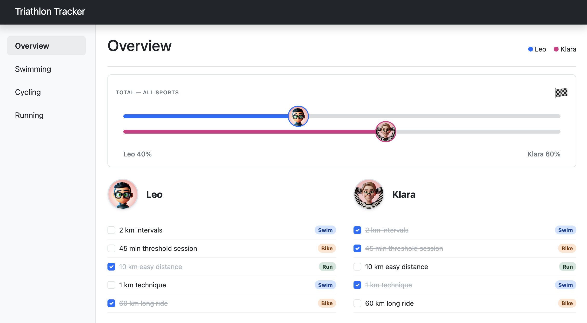

# Triathlon Tracker


**Triathlon Tracker** is a collaborative project between two friends preparing for our first triathlon. Designed by Klara and Leo, this app helps us track our training progress, log workouts, and keep an eye on our total distances.

## Preview



## Features

- Track training sessions for Leo and Klara
- Toggle workout completion status
- Display total distance and workout statistics
- Responsive mobile-friendly design
- 100% type coverage and strict linting

## Installation

To set up this project locally, run the following commands:

```bash
git clone https://github.com/leozarazaga/triathlon-tracker.git
cd triathlon-tracker
npm install
```

## Running the Project

This project uses `concurrently` to run both the frontend and the `json-server` mock database simultaneously.

Start the full development environment with:

```bash
npm start
```

- The React frontend will run via Vite (typically at `http://localhost:5173`)
- The mock database (`json-server`) will run at `http://localhost:3000`

## Quality Checks

Run linting, type checking, and type coverage with:

```bash
npm run check
```

This runs:

- **ESLint** – Linting and formatting
- **TypeScript strict checks** – Strict type checking
- **Type Coverage** – 100% coverage (no `any`)

## Technologies Used

- **React 19 + TypeScript 6** – Component-based UI with strict typing
- **Vite 8** – Fast development server and build tool
- **JSON Server** – Local mock API for training data
- **Axios** – HTTP client for API requests with async/await
- **Bootstrap 5 + Sass** – UI components and custom styling
- **ESLint 10 + Type Coverage** – Code quality and maximum type safety

## Contributing

Contributions are welcome! To contribute:

1. Fork the repo
2. Create a feature branch (`git checkout -b feature/my-feature`)
3. Commit your changes (`git commit -m 'Add new feature'`)
4. Push the branch (`git push origin feature/my-feature`)
5. Open a pull request

## License

This project is licensed under the [MIT License](./LICENSE).

You are free to use, modify, and distribute this software, provided the original copyright and permission notices are included.
